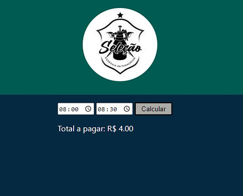

 

<h1 align="center"> Sistema de cobrança de um estacionamento. </h1>

 

## 💻 Projeto

Desenvolvi um simples sistema de cálculo de cobrança de um estacionamento.

Requisitos:

- A primeira meia hora deve ser cobrado R$ 4,00 (independente se 
ficou 1 minuto ou se ficou os 30 minutos, estando na primeira meia 
hora será cobrado o valor de R$ 4,00)

- após a primeira meia hora será cobrado R$ 2,00 a cada 15 minutos.
Contando por unidades de 15 min sempre arredondando para o maior.
Exemplo:

31 min arredondar para 45min  
47 min arredondar para 1 hora

## 🚀 Tecnologias

Esse projeto foi desenvolvido com as seguintes tecnologias:

- HTML e CSS
- JavaScript
- Git e Github
- GIMP

## 🔖 Layout

  

## &#x1F517; Link:
Link do projeto pronto : https://jeffbveiga.github.io/Calculadora-hora-estacionamento/

